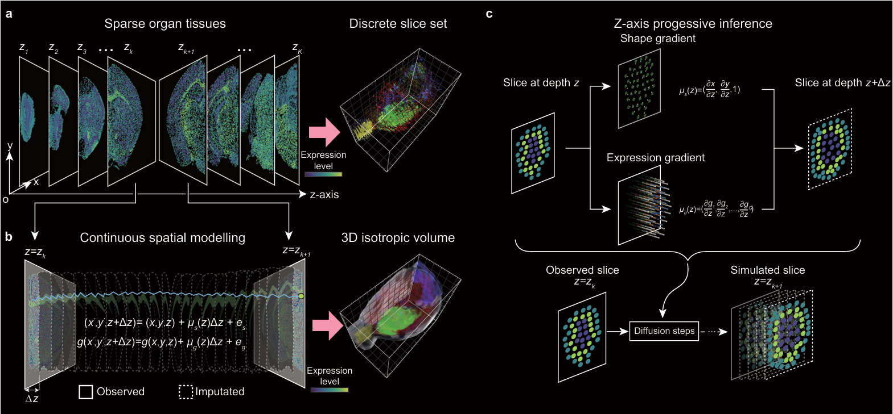
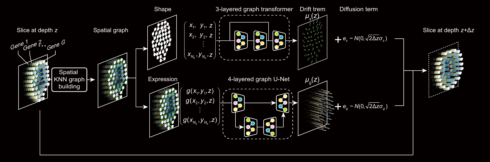

# Three-dimensional spatial transcriptomics at isotropic resolution enabled by artificial intelligence

isoST is a generative model designed to reconstruct 3D spatial transcriptomic profiles with isotropic resolutions from sparsely sampled serial sections.


## Overview

Accurately mapping isotropic-resolution 3D spatial transcriptomes is a major challenge in biology. Current technologies cannot directly achieve full 3D profiling, so tissues are typically sectioned into serial 2D slices for individual profiling.

We present **isoST**, a framework to reconstruct continuous, isotropic-resolution 3D transcriptomic landscapes from sparsely sampled serial sections. Assuming gene expression varies smoothly in 3D space, isoST models expression dynamics along tissue depth using stochastic differential equations (SDEs), producing a continuous 3D field that enables high-fidelity reconstruction from limited slices.



> **Fig. 1 | An overview of the isoST.**(**a**) isoST takes as input a series of  K parallel two-dimensional (2D) spatial transcriptomics slices. (**b**) isoST models spatial continuity along the z-axis using stochastic differential equations (SDEs) to reconstruct 3D transcriptomics profiles at isotropic resolution. Starting from an observed slice at depth $z_{k}$ , the model iteratively propagates each cell’s spatial position and gene expression to the next layer $z_{k+1}$ through integration over small steps of size $\Delta z$.  (**c**) A schematic of reconstruction steps from depth $z_{k}$ to $z_{k+1}$ . The shape gradient term $\mu_{s}(z)$ determines the directional shift in position for each cell, while the expression gradient term $\mu_{g}(z)$ estimates the gradient of gene expression used to impute the next layer.



> **Fig. 2 | The model architecture  of isoST.** Illustration of the isoST inference process from a profiled slice at depth $z$ to the next layer $z+\Delta z$ . A spatial graph is constructed using data point coordinates from the input slice. Two graph neural networks are then applied to predict the shape gradient $\mu_{s}(z)$ and the expression gradient $\mu_{g}(z)$. 

## Installation

Create the environment from the provided `environment.yml` (**fixed versions** are strongly recommended for reproducibility and to avoid dependency conflicts):

```bash
conda env create -f environment.yml
conda activate isoST
```

- Requires a GPU compatible with `torch==1.12.0` and CUDA 11.3.
- Includes `faiss-gpu==1.7.3` and PyTorch Geometric dependencies (see `environment.yml`).
- Make sure the project root is on your `sys.path` if running from a notebook (already handled in `run.ipynb`).

## Tutorial

## 1) Input Data & Directory Structure

### 1.1 Slice data (`.pt`)

One `.pt` file per slice, shape **N × (3 + feature_dim)**:

- First 3 columns: `(x, y, z)` spatial coordinates, where **`z` is the interpolation axis**.
- Remaining columns: features (in this project: **top 50 PCs** of gene expression).

Normalization:

- **x, y**: subtract each axis’s own minimum, divide both by the **max width** across x and y (ensures isotropic scaling in the xy-plane).

  - Subtract each axis’s own minimum value.

  - Divide both axes by the **maximum width** across x and y (ensuring isotropic scaling in the xy-plane).  
    
    $x' = ({x - \min(x)})/d$
    $y' = ({y - \min(y)})/d$
    $d=max\{(max(x)-min(x), max(y)-min(y)\}$
    
    This ensures isotropic scaling in the xy-plane.

Python example:
    
```python
    import torch

    # coords: tensor of shape (N, 2) for x, y
    min_x, min_y = coords[:, 0].min(), coords[:, 1].min()
    width_x = coords[:, 0].max() - min_x
    width_y = coords[:, 1].max() - min_y
    max_width = max(width_x, width_y)
    
    coords[:, 0] = (coords[:, 0] - min_x) / max_width
    coords[:, 1] = (coords[:, 1] - min_y) / max_width
```

- **PC features**: min–max normalization per feature.

### 1.2 Normalization metadata

- Store normalization parameters in the same folder as `.pt` slices:
  - `min_dic.csv` — minimum value for each dimension (`xy`, `PC_1`, …, `PC_50`).
  - `scale_dic.csv` — scaling factor for each dimension (for de-normalization).

**Example: `min_dic.csv`** (stores minimum values for each dimension)

| x    | y    | z    | PC_1 | PC_2 | PC_3 | PC_4 | ...  | PC_50 |
| ---- | ---- | ---- | ---- | ---- | ---- | ---- | ---- | ----- |
|      |      |      |      |      |      |      | ...  |       |

**Example: `scale_dic.csv`** (stores scaling factors for each dimension)

| xy   | PC_1 | PC_2 | PC_3 | PC_4 | ...  | PC_50 |
| ---- | ---- | ---- | ---- | ---- | ---- | ----- |
|      |      |      |      |      | ...  |       |

### 1.3 Gene list & PCA model

- In the project metadata folder, include:
  - `gene.csv` — column `gene_symbol` listing all genes.
  - `zscore_pc_model.pkl` — PCA model saved with joblib (used to invert PCs back to gene expression).

### 1.4 Example directory layout

```bash
data_root = /path/to/isoST
proj      = data/zhuang_ABCA_2/zscore_PC50_minmax

# Training subset (1_of_5 in the example)
{data_root}/{proj}/1_of_5_normPC_1/
  ├── Zhuang-ABCA-2.004_log_PC.pt
  ├── Zhuang-ABCA-2.005_log_PC.pt
  ├── ...
  ├── min_dic.csv
  └── scale_dic.csv

# Full dataset for inference
{data_root}/{proj}/1_of_1_normPC_1/
  ├── Zhuang-ABCA-2.004_log_PC.pt
  ├── ...
  ├── min_dic.csv
  └── scale_dic.csv

# Metadata
{data_root}/zhuang/zhuang_ABCA_2/
  ├── gene.csv
  └── zscore_PC50_minmax/
      └── zscore_pc_model.pkl
```

**Note:** file names must match the `slide_names` definition in the notebook (`_log_PC` suffix included).

## 2) Configuration file (`config.yml`)

Example:

```yaml
trainer: IsoST
params:
  gene_dim: 50         # number of PCs (must match preprocessed data)
  hidden_dim: 64       # dim of latent features
  head_num: 1
  lr: 0.001
  optimizer_name: NAdam
  weight_decay: 1e-8

  method: euler
  delta_d: 0.01        # interpolation step along z-axis
  stride: 1            # loss computation interval along depth

  std_x: 0.01   # sigma_x
  std_y: 0.01   # sigma_y
  std_z: 0.1    # sigma_z
  std_seq: 0.1  # Delta z

  alpha: 0.1
  dual: true  # bidirectional trainig and inference
  beta_start_value: 1
  beta_end_value: 0.05
  beta_start_iteration: 50
  beta_n_iterations: 50
  warm_up_rate: 1

```

Key points:

- `gene_dim` must match the PC count in your `.pt` files.
- `delta_d` controls z-step size; smaller steps yield finer interpolation but increase runtime.
- `stride=1` is the only recommended parameter.
- `std_*` and `alpha/beta` parameters are for smoothing and loss scheduling.

## 3) Notebook Workflow (from `run.ipynb`)

### Steps 1–2: Imports & seed fixing

```python
import sys
import os
import os

project_root = os.path.abspath(os.path.join(os.getcwd(), '../../'))
sys.path.append(project_root)


from utils.train_ode import biaxial_train  # custom training function
from utils.inference import fine_inference  # custom inference function
import torch
import numpy as np
import yaml
import time

import random
def seed_all(seed):
    random.seed(seed)
    np.random.seed(seed)
    torch.manual_seed(seed)
    torch.cuda.manual_seed_all(seed)
    torch.backends.cudnn.deterministic = True
    torch.backends.cudnn.benchmark = False


seed_all(0)
```

### Steps 3-4: Define slice names & project paths

```python
slide_names_ = ['Zhuang-ABCA-2.004', 'Zhuang-ABCA-2.005', 'Zhuang-ABCA-2.006',
   'Zhuang-ABCA-2.007', 'Zhuang-ABCA-2.008', 'Zhuang-ABCA-2.009',
   'Zhuang-ABCA-2.010', 'Zhuang-ABCA-2.011', 'Zhuang-ABCA-2.012',
   'Zhuang-ABCA-2.013', 'Zhuang-ABCA-2.014', 'Zhuang-ABCA-2.015',
   'Zhuang-ABCA-2.016', 'Zhuang-ABCA-2.017', 'Zhuang-ABCA-2.018',
   'Zhuang-ABCA-2.019', 'Zhuang-ABCA-2.020', 'Zhuang-ABCA-2.021',
   'Zhuang-ABCA-2.022', 'Zhuang-ABCA-2.023', 'Zhuang-ABCA-2.025',
   'Zhuang-ABCA-2.026', 'Zhuang-ABCA-2.027', 'Zhuang-ABCA-2.028',
   'Zhuang-ABCA-2.030', 'Zhuang-ABCA-2.031', 'Zhuang-ABCA-2.032',
   'Zhuang-ABCA-2.033', 'Zhuang-ABCA-2.034', 'Zhuang-ABCA-2.035',
   'Zhuang-ABCA-2.036', 'Zhuang-ABCA-2.037', 'Zhuang-ABCA-2.039',
   'Zhuang-ABCA-2.040', 'Zhuang-ABCA-2.041', 'Zhuang-ABCA-2.042',
   'Zhuang-ABCA-2.044', 'Zhuang-ABCA-2.045', 'Zhuang-ABCA-2.046',
   'Zhuang-ABCA-2.047', 'Zhuang-ABCA-2.048', 'Zhuang-ABCA-2.049',
   'Zhuang-ABCA-2.050', 'Zhuang-ABCA-2.051', 'Zhuang-ABCA-2.052',
   'Zhuang-ABCA-2.053', 'Zhuang-ABCA-2.054', 'Zhuang-ABCA-2.055',
   'Zhuang-ABCA-2.056', 'Zhuang-ABCA-2.057', 'Zhuang-ABCA-2.058',
   'Zhuang-ABCA-2.059', 'Zhuang-ABCA-2.060', 'Zhuang-ABCA-2.061']

dim = 50
slide_names = [f'{name}_log_PC' for name in slide_names_]

proj = f'data/zhuang/zhuang_ABCA_2/zscore_PC{dim}_minmax'
batch_num = 5  # 1_of_5 subset example
data_dir = f'{data_root}/{proj}/1_of_{batch_num}_normPC_1'
```

Key points:

- The slice names are ordered by their z-axis positions (ascending or descending is acceptable,  but the order must be **consistent**)

### Step 5: Load config

```python
with open(config_file, 'r') as f:
    config = yaml.safe_load(f)
dd = config['params']['delta_d']
```

### Step 6: Training parameters

```python
device = 'cuda:0'
checkpoint_every = 20
backup_every = 5
epochs = [100, 100, 100]  # three training phases
mode = 'joint'
```

### Step 7: Create experiment and result directories

```python
experiment_dir = f'experiments'  # saving the config file and model parameter
result_dir = f'result'  # saving the inference result
if not os.path.exists(result_dir):
    os.makedirs(result_dir)
```

### Step 8: Train

```python
from utils.train_ode import biaxial_train

biaxial_train(
    experiment_dir=experiment_dir,
    data_dir=data_dir,
    slide_names=slide_names,
    batch_num=1,
    config_file=config_file,
    device=device,
    checkpoint_every=checkpoint_every,
    backup_every=backup_every,
    epoch=epochs,
    mode=mode
)

```

where

```python
def biaxial_train(
        experiment_dir,
        data_dir,
        slide_names,
        batch_num,
        config_file,
        device,
        checkpoint_every,
        backup_every,
        epoch,
        mode,
) -> object:
    """
    Main training function for isoST.
    This function:
    1) Loads configuration settings
    2) Initializes the trainer
    3) Loads the dataset
    4) Runs the training loop

    Args:
        experiment_dir (str): Path to save experiment outputs and checkpoints.
        data_dir (str): Path to preprocessed input data.
        slide_names (list): List of slice identifiers (without file extension).
        batch_num (int): Number of batches (or subset index) used for training.
        config_file (str): Path to YAML configuration file.
        device (str): Device identifier (e.g., 'cuda:0' or 'cpu').
        checkpoint_every (int): Interval (epochs) to save model checkpoints.
        backup_every (int): Interval (epochs) to save backup checkpoints.
        epoch (list): Training epochs for each phase.
        mode (str): Training mode (e.g., 'joint', 'shape', 'expression').
    """

    # -----------------------------
    # Load the configuration file
    # -----------------------------
    with open(config_file, 'r') as file:
        config = yaml.safe_load(file)

    # ---------------------------------------
    # Save a copy of config into experiment_dir
    # (ensures reproducibility and record-keeping)
    # ---------------------------------------
    os.makedirs(experiment_dir, exist_ok=True)
    with open(os.path.join(experiment_dir, 'config.yml'), 'w') as file:
        yaml.dump(config, file)

    # ----------------------------------------------------
    # Dynamically instantiate the trainer from config file
    # Example: if config['trainer'] == 'IsoST', will create IsoST(**params)
    # ----------------------------------------------------
    TrainerClass = getattr(training_module, config['trainer'])
    trainer = TrainerClass(device=device, **config['params'])
    trainer.to(device)  # Move model to the specified device

    ###########
    # Dataset #
    ###########
    # ---------------------------------------------------------
    # Load the training dataset:
    #   - Reads .pt slice files from data_dir
    #   - Selects slices according to slide_names & batch_num
    #   - Applies mode-specific preprocessing if needed
    # ---------------------------------------------------------
    train_set = get_dataset(data_dir, slide_names, batch_num, device, mode)

    # ---------------------
    # Start the optimization
    # ---------------------
    tqdm.write('========== Optimization ============')
    train(
        trainer,             # Model/trainer instance
        experiment_dir,      # Where to save checkpoints
        train_set,           # Loaded dataset
        batch_num,           # Number of batches/subsets
        epoch,               # Epochs per phase
        checkpoint_every,    # Save checkpoint frequency
        backup_every         # Save backup frequency
    )

```

### Step 9: Inference on full dataset

```python
from utils.inference import fine_inference

total_data_dir = f'{data_root}/{proj}/1_of_1_normPC_1/'
fine_inference(
    experiment_dir,
    total_data_dir,
    slide_names,
    mode,
    dd,
    result_dir,
    batch_num,
    device
)
```

where

```python
def fine_inference(
        experiment_dir,
        data_dir,
        u_name_list,
        mode,
        defined_d,
        result_dir,
        batch_num,
        device='cuda'
):
    """
    Perform fine-grained inference using a trained isoST model.

    This function:
    1) Loads a pretrained model and configuration from experiment_dir
    2) Initializes the trainer
    3) Runs the fine inference process to reconstruct intermediate slices

    Args:
        experiment_dir (str): Directory containing trained model and config.
        data_dir (str): Path to preprocessed input data (full dataset for inference).
        u_name_list (list): List of slice identifiers for inference.
        mode (str): Inference mode (e.g., 'joint', 'shape', 'expression').
        defined_d (float): Δz step size for interpolation during inference.
        result_dir (str): Directory to save inference outputs.
        batch_num (int): Number of batches (or subset index) used in inference.
        device (str): Device to run inference on ('cuda' or 'cpu').
    """

    config_file = None

    # ----------------------------------------------------
    # Check if the experiment directory already contains
    # both the trained model and configuration file
    # ----------------------------------------------------
    pretrained = os.path.isfile(os.path.join(experiment_dir, 'model.pt')) \
                 and os.path.isfile(os.path.join(experiment_dir, 'config.yml'))

    resume_training = pretrained

    if resume_training:
        load_model_file = os.path.join(experiment_dir, 'model.pt')
        config_file = os.path.join(experiment_dir, 'config.yml')

    # -----------------------------
    # Load configuration parameters
    # -----------------------------
    with open(config_file, 'r') as file:
        config = yaml.safe_load(file)

    # ---------------------------------------
    # Save a copy of config back to experiment_dir
    # (ensures the config used for inference is recorded)
    # ---------------------------------------
    with open(os.path.join(experiment_dir, 'config.yml'), 'w') as file:
        yaml.dump(config, file)

    # ----------------------------------------------------
    # Dynamically instantiate the trainer from config file
    # ----------------------------------------------------
    TrainerClass = getattr(training_module, config['trainer'])
    trainer = TrainerClass(device=device, **config['params'])

    # ---------------------------
    # Create result directory if missing
    # ---------------------------
    if not os.path.exists(result_dir):
        os.makedirs(result_dir)

    # -------------------------------------------------
    # Load pretrained model weights (if available)
    # -------------------------------------------------
    if load_model_file:
        trainer.load(load_model_file)
        print('Pretrained Model Loaded!')

    # Move trainer to the specified device
    trainer.to(device)

    #############
    # inference #
    #############
    # Run fine-grained inference to reconstruct slices
    trainer.fine_infer(
        data_dir,        # Path to input data
        u_name_list,     # List of slice names
        mode,            # Inference mode
        defined_d,       # Interpolation step size
        result_dir,      # Output directory
        batch_num,       # Number of batches/subset index
        device           # Device for computation
    )
```

## 4) Post-processing (3D volume reconstruction)

### Step 10: Initialize processor

```python
from utils.postprocess import VolumeProcessor
gene = pd.read_csv(f"{data_root}/zhuang/zhuang_ABCA_2/gene.csv", index_col=0)

processor = VolumeProcessor(
    data_dir=f"{data_root}/zhuang/zhuang_ABCA_2",
    result_dir=result_dir,
    volume_size=(1.0, 0.8, 0.5),
    gene_list=gene['gene_symbol'].tolist(),
    max_lence=220
)

```

### Step 11: Convert to voxel volume

```python
volume, count = processor.result_to_volume(n_features=50, swamp=True)
pc_df = processor.volume_to_df(volume)

np.save(f"{result_dir}/volume.npy", volume)
np.save(f"{result_dir}/density.npy", count)
pc_df.to_csv(f"{result_dir}/pc_volume.csv")

```

## 5) PC → Gene expression recovery

### Step 12: Inverse transform using PCA model

```python
import joblib

pc_model = joblib.load(
    f"{data_root}/zhuang/zhuang_ABCA_2/zscore_PC50_minmax/zscore_pc_model.pkl"
)

processor.pc_to_expression(volume, pc_model, 220)
```

Outputs a parquet file:

```python
import pyarrow.parquet as pq
table = pq.read_table(f"{result_dir}/log2_expr_220_all_pc.parquet")
predictions = table.to_pandas().astype('float32')

```

## 6) Visualization

The notebook uses Plotly for interactive 3D visualization of points/voxels (`scene_dragmode='orbit'`, `aspectmode='data'`).
 You can visualize from:

- `volume.npy` (PC volume)
- `density.npy` (point density)
- Parquet gene expression output

## 7) Output Checklist

- `experiments/`: training checkpoints & logs
- `result/volume.npy`: PC volume array
- `result/density.npy`: voxel density array
- `result/pc_volume.csv`: PCs in table form
- `result/log2_expr_220_all_pc.parquet`: log2 gene expression volume

Consistency checks:

- `gene_dim` in config matches feature_dim in `.pt`
- `slide_names` match `.pt` filenames (`_log_PC` suffix)
- `min_dic.csv` & `scale_dic.csv` are present with `.pt` files
- PCA model matches PC count
- Adjust `delta_d` or `batch_num` for memory/runtime balance

## Copyright

Software provided as is under **MIT License**.

Bohan Li @ 2025 BUAA and Deng ai Lab

Permission is hereby granted, free of charge, to any person obtaining a copy of this software and associated documentation files (the "Software"), to deal in the Software without restriction, including without limitation the rights to use, copy, modify, merge, publish, distribute, sublicense, and/or sell copies of the Software, and to permit persons to whom the Software is furnished to do so, subject to the following conditions:

The above copyright notice and this permission notice shall be included in all copies or substantial portions of the Software.

THE SOFTWARE IS PROVIDED "AS IS", WITHOUT WARRANTY OF ANY KIND, EXPRESS OR IMPLIED, INCLUDING BUT NOT LIMITED TO THE WARRANTIES OF MERCHANTABILITY, FITNESS FOR A PARTICULAR PURPOSE AND NONINFRINGEMENT. IN NO EVENT SHALL THE AUTHORS OR COPYRIGHT HOLDERS BE LIABLE FOR ANY CLAIM, DAMAGES OR OTHER LIABILITY, WHETHER IN AN ACTION OF CONTRACT, TORT OR OTHERWISE, ARISING FROM, OUT OF OR IN CONNECTION WITH THE SOFTWARE OR THE USE OR OTHER DEALINGS IN THE SOFTWARE.


