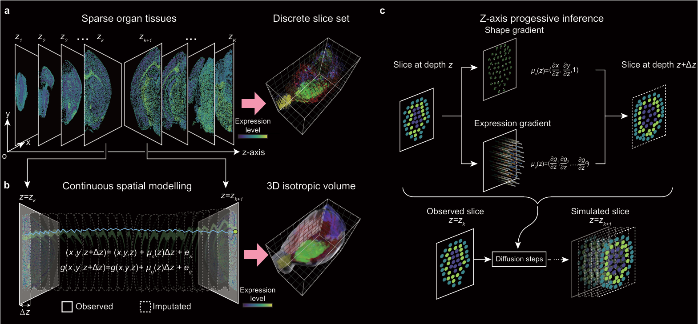
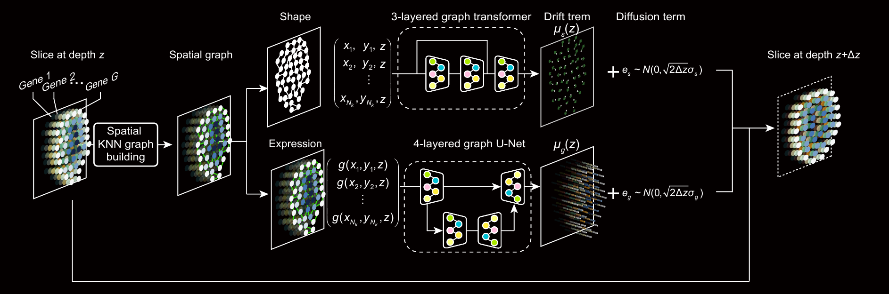

# Reconstructing isotropic resolution 3D spatial transcriptomics from serial 2D sections by modeling tissue continuity

isoST is a generative model for reconstructing 3D spatial transcriptomic profiles with isotropic resolution from sparsely sampled serial sections. It starts from profiled 2D spatial transcriptomics slices, models tissue continuity along the z axis with stochastic differential equations, and infers a continuous 3D expression field.


Accurately mapping isotropic resolution 3D spatial transcriptomes is a major challenge in biology. Current technologies cannot directly profile dense 3D tissue volumes, so tissues are commonly sectioned into serial 2D slices. isoST assumes gene expression changes smoothly through tissue depth and uses graph neural networks to estimate spatial and expression gradients between observed slices.



> **Fig. 1 | An overview of isoST.** (**a**) isoST takes as input a series of K parallel two dimensional spatial transcriptomics slices. (**b**) isoST models spatial continuity along the z axis using stochastic differential equations to reconstruct 3D transcriptomics profiles at isotropic resolution. Starting from an observed slice at depth $z_{k}$, the model iteratively propagates each cell's spatial position and gene expression to the next layer $z_{k+1}$ through integration over small steps of size $\Delta z$. (**c**) The shape gradient term $\mu_{s}(z)$ determines the directional shift in position for each cell, while the expression gradient term $\mu_{g}(z)$ estimates the gene expression gradient used to impute the next layer.



> **Fig. 2 | The model architecture of isoST.** isoST infers the next layer from a profiled slice at depth $z$ to $z+\Delta z$. A spatial graph is built from input coordinates. Two graph neural networks predict the shape gradient $\mu_{s}(z)$ and expression gradient $\mu_{g}(z)$.

## Quick Start

1. Create the environment:

```bash
conda env create -f environment.yml
conda activate isoST
```

2. Download and extract the tutorial data:

```bash
python script/download_data.py --extract
```

This creates the repository-root `data/` directory expected by the tutorial notebooks.

3. Start the mouse brain tutorial:

```bash
cd script/mouse_brain
jupyter notebook run.ipynb
```

4. Follow the notebook to train, run inference, and inspect outputs in `experiments/` and `result/`.

For alternative workflows, open `script/img_reg/run.ipynb` or `script/mouse_embryo/run.ipynb` from their own workflow directories. For downloader options such as dry runs, verification, or `cache/` extraction, see [Data Download](#data-download).

## Installation

The provided environment uses conda package versions for reproducibility. It creates an environment named `isoST` with Python 3.9.19, PyTorch 1.12 with CUDA 11.3 support, the PyTorch Geometric stack, and Jupyter.

```bash
conda env create -f environment.yml
conda activate isoST
```

Notes:

- Use a CUDA capable GPU compatible with PyTorch 1.12 and CUDA 11.3 for the tutorial workloads.
- Keep the repository root as the working project root. The notebooks add it to `sys.path` by computing `../../` from their workflow directories.
- If you run notebooks from a different directory, path resolution can break.

## Data Download

The downloader is `script/download_data.py`. The archived data is hosted on Figshare with DOI `10.6084/m9.figshare.30043246`.

Recommended commands:

```bash
python script/download_data.py --dry-run
python script/download_data.py --extract
python script/download_data.py --output cache --extract
python script/download_data.py --output cache --verify-only
```

Download notes:

- By default, the script saves `data.rar` in the repository root and `--extract` populates `data/`, which is the path expected by the notebooks.
- `cache/` is gitignored. When `--output cache` is used with `--extract`, extraction creates `cache/data` instead.
- If you keep data in `cache/data`, update notebook paths or copy/symlink it to `data/` before running the tutorials.
- Validated extraction uses `unrar` when available. Compatible alternatives include `7zz`, `7z`, or `bsdtar`, although older `7z` builds may not support this RAR archive.
- The downloader can verify downloaded files without fetching again by using `--verify-only`.
- The archive contains these top-level data folders: `CCFv3_feature`, `CS7`, `kidney`, `mouse_embryo`, `spinal_cord`, `zhuang_ABCA_2`, and `zhuang_ABCA_3`.

## Tutorial Notebooks

The repository includes three onboarding notebooks:

- `script/mouse_brain/run.ipynb`
- `script/img_reg/run.ipynb`
- `script/mouse_embryo/run.ipynb`

Run each notebook from its own `script/<workflow>/` directory. The notebooks compute `project_root` via `../../`, so starting Jupyter from another directory can point imports and data paths at the wrong location.

The notebooks demonstrate the main workflow: load a config, define ordered slice names, train isoST on a provided subset, run inference on the full slice set, postprocess inferred PCs into a 3D volume, and save workflow specific outputs.

## Documentation

Detailed tutorial notes are organized in `docs/`:

- [Documentation index](docs/index.md)
- [Data format and layout](docs/data.md)
- [Configuration](docs/configuration.md)
- [Notebook workflows](docs/notebook-workflows.md)
- [Post-processing](docs/post-processing.md)
- [Results and visualization](docs/results-and-visualization.md)

## License

Software provided as is under **MIT License**.

Bohan Li @ 2025 BUAA and Deng ai Lab

Permission is hereby granted, free of charge, to any person obtaining a copy of this software and associated documentation files (the "Software"), to deal in the Software without restriction, including without limitation the rights to use, copy, modify, merge, publish, distribute, sublicense, and/or sell copies of the Software, and to permit persons to whom the Software is furnished to do so, subject to the following conditions:

The above copyright notice and this permission notice shall be included in all copies or substantial portions of the Software.

THE SOFTWARE IS PROVIDED "AS IS", WITHOUT WARRANTY OF ANY KIND, EXPRESS OR IMPLIED, INCLUDING BUT NOT LIMITED TO THE WARRANTIES OF MERCHANTABILITY, FITNESS FOR A PARTICULAR PURPOSE AND NONINFRINGEMENT. IN NO EVENT SHALL THE AUTHORS OR COPYRIGHT HOLDERS BE LIABLE FOR ANY CLAIM, DAMAGES OR OTHER LIABILITY, WHETHER IN AN ACTION OF CONTRACT, TORT OR OTHERWISE, ARISING FROM, OUT OF OR IN CONNECTION WITH THE SOFTWARE OR THE USE OR OTHER DEALINGS IN THE SOFTWARE.
